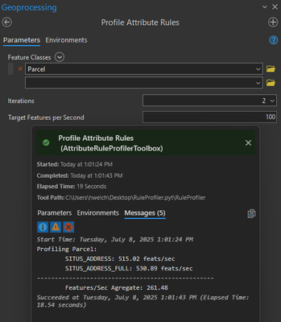

# Attribute Rule Profiler
A simple tool for priofiling your attribute rule performace by isolating each rule of a feature class and determining the amount of features it can run on per second. Additionally determines the agregate features per second of a featureclass with all the rules enabled.

# Usage
1) Save the `RuleProfiler.pyt` file in this repo to your local machine and add it to Pro
2) Open the `Profile Attribute Rules` tool in the toolbox
3) Parameters:
   1) **Feature Classes**: The feature classes to profile
   2) **Iterations**: The amount of time to run the rule on the dataset (to smooth out variance)
   3) **Target Features per Second**: The target for each rule
      1) Any rule that processes under this target will print a `Warning`
      2) Any rule that processes under *half* this target will print an `Error`
4) Output:
 
   